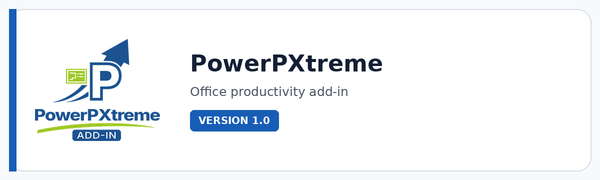

# PowerPXtreme

**A PowerPoint productivity toolkit for faster slide production, smarter paste workflows, precise layouts, polished exports, and presentation-scale automation.**

  

  

---

## Overview

PowerPXtreme is built for people who create, revise, and deliver presentations at scale. It extends PowerPoint with practical tools for repetitive slide work: Smart Paste, sticky notes, object alignment, layout, image cropping, speaker notes, unit conversion, optimization, export, selection, and presentation utilities.

The goal is not to replace PowerPoint's native workflow. It is to make that workflow dramatically more efficient. Consultants, PMO teams, business leaders, designers, trainers, sales teams, and presentation-heavy professionals can spend less time fixing the mechanics of slides and more time shaping the story.

## Get the current build

This product is shared directly with supporters instead of through a public download link. [Support development on Ko-fi](https://ko-fi.com/pacosalasv) and include **the product name and the email address where you want to receive it** in your message. I will send the current available build directly.

Direct distribution keeps access personal, connects product feedback with active users, and gives supporters a simple route to the current build without hunting through mirrors or outdated packages.

## Key features

- **Smart Paste across slide scopes** with replace or append behavior for selected, all, visible, hidden, or new slides.
- **Layout and object production tools** for reference alignment, exact gaps, distribution, grid layout, slide fitting, selection, and reversible size randomization.
- **Smart Crop and picture workflows** for crop/fill/fit, slide-bound cleanup, position normalization, and faster visual consistency.
- **Rich Sticky Notes** with basic, pastel, bright, neutral, transparent, and custom colors for reviews, workshops, storyboards, and collaboration.
- **Text and speaker-note utilities** covering case conversion, note formatting/removal, symbols, and presentation-friendly text workflows.
- **Slide maintenance tools** including slide-number refresh, master cleanup, layout reset, and presentation-arrow utilities.
- **Professional export options** for PDF and high-resolution slide images, including very-high-resolution image export presets.
- **Unit conversion and design helpers** that reduce manual calculations while building technically precise presentations.

## Standout tools and workflows

| Tool / workflow | Why it matters |
|---|---|
| **Smart Paste** | Replace or append tagged content across selected, all, visible, hidden, or newly created slides. |
| **Layout Palette** | Keep an always-available visual alignment palette open while arranging objects. |
| **Align to Reference** | Align selected shapes to a reference object with optional exact spacing while preserving structure. |
| **Grid Layout** | Reflow multiple objects into configurable rows and columns in seconds. |
| **Smart Crop** | Normalize pictures with crop, fit, fill, match and slide-bound workflows. |
| **Sticky Notes** | Create workshop/review notes from a large color library, including transparency and custom colors. |
| **Speaker Notes** | Format or remove notes across the current slide, selected slides or the full deck. |
| **Clean Slide Master** | Remove unused master content and keep presentation files easier to maintain. |
| **Export to PDF** | Control slide scope, hidden slides, document properties, accessibility options, PDF/A and font behavior. |
| **Export Slides as Images** | Create presentation images using preset or custom resolution options, including very high resolution. |

## Product status

| Item | Details |
|---|---|
| Status | **Current release** |
| Version | 1.0 |
| Product type | Office productivity add-in |
| Host | Microsoft PowerPoint |
| Best for | Consulting decks, PMO reporting, training, sales, workshops, presentation production |

## Media

Additional product screenshots and workflow previews are coming soon.

## Documentation and support

| Resource | Link |
|---|---|
| Current build | [Request supporter access](https://ko-fi.com/pacosalasv) |
| Support guide | [SUPPORT.md](SUPPORT.md) |
| Repository changelog | [CHANGELOG.md](CHANGELOG.md) |
| Issues | [Open or review issues](https://github.com/pacosalasv/PowerPXtreme-Support/issues) |
| Discussions | [Ask questions and share feedback](https://github.com/pacosalasv/PowerPXtreme-Support/discussions) |

## Support development

If this tool saves you time, Ko-fi support helps fund maintenance, compatibility work, documentation, testing, and continued development.

  

## Ecosystem

| Destination | Link |
|---|---|
| Supporter access | [Request the current build on Ko-fi](https://ko-fi.com/pacosalasv) |
| Issues & feedback | [GitHub Issues](https://github.com/pacosalasv/PowerPXtreme-Support/issues) |
| Xtreme Mindset | [Product lab](https://xtrememindset.blogspot.com/) |
| Paco Salas \| DRH | [Official site](https://pacosalasv.blogspot.com/) |
| DRH Blender tools | [BlendKit catalog](https://www.blendkit.com/?query=author_id:205846) |
| Sketchfab / Código Píxel | [3D model collections](https://sketchfab.com/codigopixel/collections) |
| KreaOn | [Technology education](https://www.kreaon.com/) |
| PiNu | [Connected physical products](https://pinu.com.mx/) |
| GitHub | [pacosalasv](https://github.com/pacosalasv) |

## License

Licensing and usage terms are provided with the current PowerPXtreme distribution.
